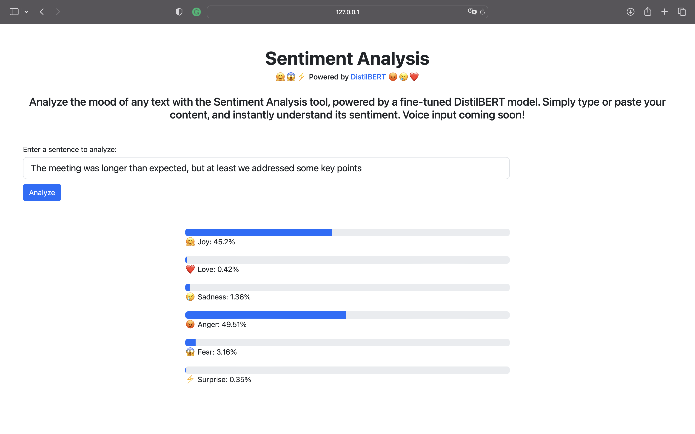

# Sentiment Analysis WebApp

A web application built with Django that performs sentiment analysis on text data using a fine-tuned DistilBERT model. Users can input text to get the sentiment as output. Future versions will include Automatic Speech Recognition (ASR) to allow users to speak instead of typing. I've enhanced the website's aesthetics using Bootstrap for the frontend, ensuring it looks polished and user-friendly.




## Features

- **Text Input**: Users can type in any text to get the sentiment as output.
- **Sentiment Output**: Instantly view the sentiment of the provided text.
- **(Coming Soon) Voice Input**: Users will be able to speak and get the sentiment of their spoken words.

## Tech Stack

- **Backend**: Django
- **Frontend**: Bootstrap (for a polished look)
- **Sentiment Analysis Model**: Fine-tuned DistilBERT
- **(Coming Soon) ASR - Automatic Speech Recognition**

## Getting Started

### Prerequisites

- Python

### Installation

1. Clone the repository:
   ```bash
   git clone https://github.com/puru-soni-04/Django_SentimentAnalysis_WebApp_Project.git
   ```

2. Navigate to the project directory:
   ```bash
   cd Django_SentimentAnalysis_WebApp_Project
   ```

3. Set up a virtual environment and activate it:
   ```bash
   python3 -m venv sentiment
   source sentiment/bin/activate # On Windows, use `sentiment\Scripts\activate`
   ```

4. Install the dependencies:
   ```bash
   pip install -r requirements.txt
   ```

5. Run the server:
   ```bash
   python manage.py runserver
   ```

6. Navigate to `http://127.0.0.1:8000/` in your browser to view the app.

## Usage

Type or paste your text into the input box.
Press enter or click the "Analyze" button.
View the sentiment of the text displayed below the input box.

## Contributing

Pull requests are welcome. For major changes, please open an issue first to discuss what you would like to change

## License
 MIT License
